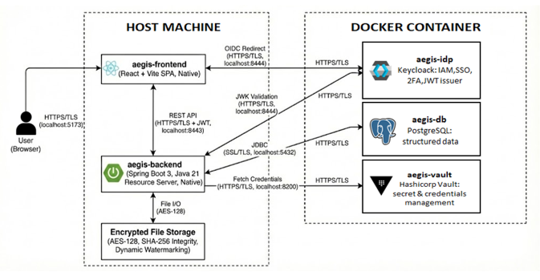

# Aegis: Secure Compartmentalized Intelligence System

> **Sistema Informativo di Intelligence Compartimentata**
> *ultra-sicuro per la gestione operativa di missioni e personale in contesti statali ad alto rischio, allineata ai massimi standard di sicurezza e alla normativa NOS (Nulla Osta di Sicurezza).*

    

---

## 1. Visione del Progetto e Metodologia

**Aegis** è un sistema informativo web progettato per rispondere ai requisiti critici delle Agenzie di Informazione e Sicurezza (es. *AISE* e *AISI*).
La piattaforma supera i tradizionali gestionali monolitici adottando un'architettura a **microservizi dockerizzati**, orchestrata per garantire resilienza e isolamento operativo.

Lo sviluppo segue rigorosamente la metodologia **Shift Left**, integrando la *Security by Design* in ogni fase del ciclo di vita del software. L'obiettivo è superare i modelli di difesa perimetrale classici in favore di un approccio **Zero Trust**: in questo scenario, nessuna entità — utente, server o servizio — gode di fiducia implicita, indipendentemente dalla sua collocazione fisica o di rete.

---

## 2. Governance, Normativa e Sovranità del Dato

Questa sezione descrive come Aegis traduce i vincoli normativi e istituzionali in regole di gestione del sistema.

### 2.1 Anagrafe Centralizzata e Verifica NOS
A differenza dei sistemi commerciali, Aegis inibisce strutturalmente l'autoregistrazione.
* **Delega all'Autorità:** L'accreditamento del personale (Agenti e Supervisori) è demandato esclusivamente a un'autorità garante terza (es. *PCM* o *DIS*).
* **Verifica delle Credenziali:** Le identità digitali vengono rilasciate solo a fronte di un valido *Nulla Osta di Sicurezza* (NOS), eliminando alla radice il rischio di utenze non verificate o "fantasma".

### 2.2 Architettura dei Dati "Dual-Layer"
Il progetto adotta una strategia di gestione dati a doppio livello per bilanciare la segretezza operativa (*Need-to-Know*) con il dovere di controllo democratico:

1.  **Operatività In-House (Segreto di Stato):** I documenti classificati e i dossier di missione sono cifrati e residenti fisicamente sull'infrastruttura dell'Agenzia operativa, assicurando la totale ermeticità delle informazioni sensibili.
2.  **Audit di Garanzia (Controllo Esterno):** L'infrastruttura tecnologica di supporto (Database Docker, Log di Audit, Vault) è centralizzata e immutabile. Questo design permette l'ispezionabilità tecnica da parte degli organi parlamentari di controllo (es. *COPASIR*), che possono verificare l'integrità del sistema e gli accessi senza necessariamente visualizzare il contenuto in chiaro dei dossier operativi.

---

## 3. Pilastri Tecnici di Sicurezza: Zero Trust Implementation

Il sistema assume che la rete sia "ostile" e protegge i dati e le risorse a livello applicativo, invece di affidarsi solo al firewall perimetrale applicato in deploy. 
<br>DI seguito sono riportati i principi che rendono "Zero Trust" AEGIS:

### A. "Never Trust, Always Verify" (Verifica Continua)
Il Backend **non si fida implicitamente** del Frontend o della rete locale.
Ogni singola richiesta HTTP verso le API viene intercettata dal `SecurityFilterChain` e validata crittograficamente. Se il token JWT non è valido, non è firmato correttamente da Keycloak o è scaduto, la richiesta viene respinta istantaneamente con `401 Unauthorized` o `403 Forbidden`, anche se proviene dall'interno della rete aziendale protetta.

### B. Principio del Privilegio Minimo (Least Privilege)
Abbiamo implementato l'accesso gerarchico rigoroso basato sul modello **Bell-LaPadula**:
* **Controllo Puntuale:** Un utente con ruolo `AGENT` può vedere solo le missioni a lui assegnate; questo controllo è verificato a livello di codice nel `MissionController`.
* **Blocco Verticale:** Un utente con clearance "Livello 1" viene bloccato dal sistema se tenta di accedere a una missione "Livello 2", anche se è in possesso di un URL valido (prevenzione *Forced Browsing*).

### C. Micro-Segmentazione e Identità
L'identità è gestita centralmente da **Keycloak**. Non esistono "utenti anonimi" o "super-user" hardcoded nel database che possano bypassare i controlli di sicurezza.
Inoltre, i servizi infrastrutturali (Database, Vault) sono isolati in container specifici e non espongono porte non necessarie verso l'esterno, riducendo la superficie d'attacco laterale.

### D. Protezione dei Dati (Data Protection)
* **In Transito:** Tutto il traffico è forzato su protocollo HTTPS sicuro (Porta 8443) con TLS 1.3.
* **A Riposo:** I file sensibili (es. PDF operativi) sono cifrati con algoritmo **AES-128** appena toccano il disco. Nemmeno l'amministratore di sistema può leggerne il contenuto senza la chiave di decifratura gestita logicamente dall'applicazione.

---

### Obiettivi Strategici e di Governance
Il sistema persegue la creazione di un ecosistema di intelligence resiliente, fondato su una catena di fiducia verificabile garantita da enti terzi:

* **Anagrafe Centralizzata e Certificata:** Aegis inibisce strutturalmente l'autoregistrazione. L'accreditamento del personale (Agenti e Supervisori) è delegato esclusivamente a un'autorità garante (es. *PCM - Presidenza del Consiglio dei Ministri* o *DIS*). Le identità digitali vengono rilasciate solo a fronte di un valido *Nulla Osta di Sicurezza* (NOS), eliminando alla radice il rischio di utenze non verificate o "fantasma".

### Architettura dei Dati e Sovranità
Il progetto adotta una strategia di gestione dati "a doppio livello" per bilanciare la segretezza operativa con il controllo democratico:

1.  **Gestione Operativa In-House:** I documenti classificati e i dossier di missione sono cifrati e residenti sull'infrastruttura dell'Agenzia operativa, assicurando la totale ermeticità delle informazioni coperte da Segreto di Stato.
2.  **Audit Centralizzato per la Garanzia:** L'infrastruttura di supporto (Database Docker, Secret Management su Vault) è centralizzata e immutabile. Questo permette l'ispezionabilità tecnica da parte degli organi parlamentari di controllo (es. *COPASIR*), che possono verificare l'integrità del sistema e i log di accesso senza necessariamente accedere al contenuto in chiaro dei dossier operativi.

### Matrice di Sicurezza & Defense in Depth
Aegis implementa controlli a più livelli per mitigare le minacce moderne:

| Minaccia / Requisito | Implementazione Tecnica in AEGIS |
| :--- | :--- |
| **Vulnerabilità Logiche (BOLA/BFLA)** | Controlli granulari nel Business Layer e uso di identificativi non sequenziali per prevenire accessi orizzontali non autorizzati. |
| **Enumerazione Dati (IDOR)** | Ricerca missioni esclusivamente tramite **UUID** (Universally Unique Identifier), rendendo impossibile indovinare gli ID delle risorse. |
| **Session Hijacking** | Sessioni **Stateless** basate su token JWT. Nessuna persistenza di sessione server-side. |
| **Compromissione Credenziali** | **MFA Obbligatoria (TOTP)**: Keycloak settato con Autenticazione a Due Fattori standard (RFC 6238). L'accesso richiede password + codice OTP generato da app mobile. |
| **Data Leakage (Files)** | **Crittografia AES-128** a riposo per tutti gli allegati.<br>**Watermarking Dinamico** sui documenti per evitare foto o condivisioni non autorizzate (es. *"RISERVATO: [USER_ID]"*). |
| **Attacchi Volumetrici (DoS)** | **Bucket4j Rate Limiting**: Filtro attivo su tutti gli endpoint (limite 5000 req/min per IP) per neutralizzare Brute Force e HTTP Flood. |
| **Phishing & XSS** | **NoLinksValidator**: Blocca URL nelle note.<br>**Sanificazione**: Stripping preventivo dei tag HTML lato frontend. |
| **Man-in-the-Middle** | **TLS/HTTPS Forzato**: Backend su porta 8443, Database via JDBC SSL, Keycloak su HTTPS. |
| **Information Disclosure** | **Exception Masking**: Il *GlobalExceptionHandler* sopprime stack trace rivelatori, restituendo messaggi generici. |

### Protocolli crittografici utilizzati
* **Data in Transit:** Backend utilizza HTTPS (Porta 8443, Keystore PKCS12). Connessione DB via JDBC SSL (`sslmode=require`).
* **Data at Rest:** File allegati cifrati con **AES-128** previa verifica integrità (**SHA-256**).
* **Hashing Password:** Gestito da Keycloak tramite standard **PBKDF2/Argon2**.

---

## 3. Architettura del Progetto
L'architettura del sistema è strutturata su un modello a **microservizi containerizzati**, orchestrati per garantire la separazione delle responsabilità e la stabilità operativa. La scelta di decentralizzare i componenti rispetto a un approccio monolitico risponde a due requisiti strutturali:

* **Resilienza e Disaccoppiamento:** La suddivisione in moduli indipendenti (Frontend, Backend, Identity Provider, Database) assicura che le funzionalità siano logicamente e fisicamente separate. Questo previene che errori localizzati compromettano l'intera infrastruttura.
* **Isolamento dell'Ambiente:** L'incapsulamento tramite container garantisce l'esecuzione dei servizi in ambienti controllati e distinti. Ciò definisce confini di sicurezza netti tra i processi e semplifica la distribuzione del software in ambienti diversificati.
<p align="center">
  
</p>


### Componenti Funzionali

* **Frontend (`aegis-frontend`):** Single Page Application (SPA) sviluppata in **React + Vite**. Funge da interfaccia utente *stateless*, gestendo la sanificazione degli input, la presentazione dei dati oscurati e le interazioni sicure con le API REST.
* **Backend (`aegis-backend`):** Resource Server basato su **Java 21 / Spring Boot 3**. Costituisce il cuore del sistema: implementa i controlli di accesso granulari (Security Filter Chain), esegue la crittografia  (AES-128) e memorizzazione dei file, gestisce il log di audit immutabile.
* **Identity Provider (`aegis-idp`):** Istanza **Keycloak** dedicata all'Identity & Access Management (IAM). Gestisce il ciclo di vita delle utenze, impone l'autenticazione MFA, e rilascia token **JWT** standard OIDC per l'autorizzazione.
* **Database (`aegis-db`):** **PostgreSQL 16**. Responsabile della persistenza relazionale di metadati e dati strutturati. Configurata per accettare connessioni esclusivamente via **SSL/TLS** per garantire la protezione dei dati in transito.
* **Secrets Management (`aegis-vault`):** **HashiCorp Vault**. Sistema centralizzato per la custodia dei segreti (password DB, chiavi API). Le credenziali vengono iniettate dinamicamente nel backend all'avvio (*Dynamic Secrets*), prevenendo la presenza di password in chiaro nel codice sorgente o nei file di configurazione.

### Decisioni architetturali

Le decisioni architetturali di Aegis rispondono a precisi requisiti di sicurezza e scalabilità, adottando pattern consolidati nell'ingegneria del software moderna:

1.  **Disaccoppiamento Frontend/Backend (Headless Architecture)**
    L'adozione di un'architettura con comunicazione esclusiva via **REST API su HTTPS** garantisce una netta separazione delle responsabilità. Il Backend agisce come puro *Resource Server* stateless, riducendo la superficie d'attacco e permettendo ai due livelli di scalare in modo indipendente.

2.  **Containerizzazione dei Servizi Critici**
    L'uso di Docker per i componenti infrastrutturali (Database, Keycloak, Vault) assicura l'immutabilità dell'ambiente e la coerenza tra sviluppo e produzione (*Environment Parity*). Mantenere l'applicazione su host in fase di sviluppo permette invece cicli di debug più rapidi.

3.  **Delega dell'Autenticazione (Pattern OIDC):**
    Il sistema delega interamente la gestione dell'identità all'Identity Provider esterno (**Keycloak**). Il backend non manipola password ma valida esclusivamente la firma crittografica dei token **JWT**, centralizzando la sicurezza e impedendo la registrazione autonoma (No Self-Registration) in conformità ai requisiti NOS.

4.  **Gestione Dinamica dei Segreti:**
    Per mitigare il rischio di *Secret Sprawl*, Aegis integra **HashiCorp Vault**. Le credenziali del database vengono iniettate dinamicamente nel contesto dell'applicazione solo all'avvio (*Fetch Credentials*), evitando la presenza di dati sensibili statici nel codice sorgente.

5.  **Storage Ibrido Ottimizzato:**
    Si adotta una strategia di persistenza mista per massimizzare le performance: i metadati relazionali risiedono su **PostgreSQL**, mentre i payload binari (allegati) sono archiviati su disco locale cifrati con **AES-128**. Questo evita di appesantire il database con BLOB voluminosi, mantenendo le query performanti.

### Albero directory del progetto

L'organizzazione del codice sorgente rispetta il principio di **Separazione delle Responsabilità**. La struttura è modulare e separa nettamente il codice applicativo (/aegis-frontend e /aegis-backend) dalla configurazione infrastrutturale (/docker-env) e dal materiale crittografico (/certs e configurazioni ssl: /postgress-ssl, /keyloack-ssl), facilitando la manutenibilità e la sicurezza del deployment.

```text
AEGIS/
├── 📂 aegis-frontend/           # [FRONTEND] React Single Page Application (SPA)
│   ├── src/
│   │   ├── App.jsx             # Logica principale UI e Router
│   │   └── keycloak.js         # Configurazione Adapter OIDC
│   ├── public/                 # Asset statici
│   └── package.json            # Dipendenze Node.js
│
├── 📂 backend/
│   └── aegis-backend/          # [BACKEND] Spring Boot Application (Java 21)
│       ├── src/main/java/com/aegis/backend/
│       │   ├── controller/     # REST Endpoints Layer
│       │   ├── service/        # Business Logic Layer
│       │   ├── model/          # JPA Entities
│       │   ├── dto/            # Data Transfer Objects
│       │   └── security/       # Security Configuration (JWT, Filters)
│       ├── uploads/            # [LOCAL STORAGE] File cifrati (AES-128)
│       └── pom.xml             # Dipendenze Maven
│
├── 📂 docker-env/              # [INFRASTRUCTURE] Componenti Dockerizzati
│   ├── 📄 docker-compose.yml   # Orchestratore servizi
│   ├── 📂 init-db/             # Script SQL inizializzazione
│   ├── 📂 themes/              # Temi Keycloak
│   └── 📄 realm-export.json    # Configurazione Realm Keycloak
│
├── 📂 certs/                   # Certificati SSL/TLS condivisi
├── 📂 postgres-ssl/            # Chiavi Database
├── 📂 keycloak-ssl/            # Chiavi Identity Provider
└── 📄 *_SETUP.md               # Guide installazione
```

---

## 4. Stack Tecnologico

| Componente | Tecnologia | Ruolo |
| :--- | :--- | :--- |
| **Backend** | Java 21, Spring Boot 3 | Resource Server, Business Logic |
| **Frontend** | React, Vite | Interfaccia Utente SPA  |
| **Auth** | OIDC, OAuth 2.0, JWT | Standard di Protocollo |
| **IAM** | Keycloak | Identity Provider, MFA, RBAC  |
| **Database** | PostgreSQL 16 | Persistenza Dati  |
| **Security** | HashiCorp Vault | Gestione Segreti  |
| **Crittografia** | AES-128, SHA-256 | Cifratura Dati e Integrità  |

### Approfondimento: Flusso OIDC

Il flusso **OIDC (OpenID Connect)** delega l'autenticazione a Keycloak, che rilascia un token di autorizzazione all'applicazione richiedente.

1.  **Richiesta:** Il client richiede accesso.
2.  **Concessione:** L'utente si autentica (MFA) su Keycloak.
3.  **Token:** Keycloak emette un *Access Token* (JWT).
4.  **Accesso:** Il client allega il token nell'header `Authorization: Bearer`.
5.  **Verifica:** Il backend valida crittograficamente firma (JWK), scadenza (`exp`) ed emittente (`iss`) prima di servire la risorsa.

---

## 5. Modello Operativo e Ruoli

Il sistema gestisce la gerarchia e l'accesso ai dati su tre livelli di segretezza, ispirandosi alla logica **Bell-LaPadula**.

| Ruolo | Permessi e Visibilità |
| :--- | :--- |
| **Super Supervisor** | Amministrazione totale, visibilità globale, accesso ai Log di Audit.  |
| **Supervisor** | Creazione missioni, coordinamento assegnazione agenti a missioni.  |
| **Agent** | Operatività sul campo. Accesso limitato a pagina proprie missioni.  |

### Nota sulla Gestione delle Utenze
> La scelta architetturale di **inibire la registrazione autonoma degli utenti** risponde a un principio fondamentale di sicurezza nazionale. L'accesso deve essere concesso esclusivamente tramite canali istituzionali gerarchici, impedendo a chiunque di registrarsi senza una preventiva verifica della clearance e del Nulla Osta di Sicurezza.

---

## 7. Test d'uso

## 8. Test d'abuso

## 9. Guida all'Installazione (Docker Environment)

**Prerequisiti:** Docker Desktop, Java 21, Node.js 20+.

### 1. Avvio Infrastruttura
Lanciare i servizi di supporto (DB, Keycloak, Vault).

```bash
cd docker-env
docker-compose up -d
# Attendere l'inizializzazione dei container.
```

### 2. Configurazione Backend
Il backend attende che Vault e DB siano pronti.

```bash
cd backend/aegis-backend
mvn spring-boot:run
```
*Il server si avvierà sulla porta **8443** (HTTPS).*

### 3. Avvio Frontend

```bash
cd aegis-frontend
npm install
npm run dev
```
*Accessibile a https://localhost:5173.*

Nota: Essendo un ambiente locale con certificati auto-firmati (certs/), sarà necessario accettare le eccezioni di sicurezza nel browser per localhost:8443 (Backend) e localhost:8444 (Keycloak).

**Nota per l'installazione:** Questa guida fornisce i passaggi rapidi per l'avvio tramite Docker.
> Per istruzioni dettagliate passo-passo specifiche per il tuo sistema operativo (configurazione variabili d'ambiente, prerequisiti, ecc.), consulta i file dedicati presenti nella root del progetto:
> * `WINDOWS_SETUP.md`
> * `MAC_SETUP.md`
> * `LINUX_SETUP.md`

## 10. Riferimenti Normativi e Teorici

L'architettura di sicurezza di Aegis è stata progettata in conformità con i seguenti standard governativi e modelli accademici:

* **[DPCM 6 novembre 2015](https://www.gazzettaufficiale.it/eli/id/2015/12/01/15A09048/sg)** – *"Disposizioni per la tutela amministrativa del segreto di Stato e delle informazioni classificate"*: Costituisce il riferimento normativo per la gestione del **NOS** (Nulla Osta di Sicurezza) e per i livelli di classificazione implementati nel sistema.

* **Modello Bell-LaPadula (1973)** – Modello formale per il controllo degli accessi mandatorio (**M.A.C.**): Il sistema applica rigorosamente la proprietà matematica *No Read Up* per garantire la confidenzialità dei dati tra livelli gerarchici differenti.

* **[NIST SP 800-207](https://csrc.nist.gov/publications/detail/sp/800-207/final)** – *"Zero Trust Architecture"*: Standard statunitense che guida l'approccio architetturale del progetto, basato sul principio che nessuna fiducia sia implicita (indipendentemente dalla posizione di rete) e sulla verifica continua di ogni transazione.


## 11. Risoluzione Problemi (Troubleshooting)

In caso di difficoltà durante l'avvio o l'utilizzo della piattaforma in ambiente locale, consultare la seguente tabella:

| Sintomo | Causa Probabile | Soluzione Tecnica |
| :--- | :--- | :--- |
| **Browser: "La connessione non è privata" / "Not Secure"** | Utilizzo di certificati SSL auto-firmati per `localhost` (non riconosciuti dalle CA pubbliche). | Cliccare su **"Avanzate"** -> **"Procedi su localhost (non sicuro)"**. È necessario accettare l'eccezione sia per il Frontend (`:5173`) che per il Backend/Keycloak (`:8443`, `:8444`). |
| **Backend: "Connection Refused" all'avvio** | *Race Condition* nell'orchestrazione Docker: il Backend tenta di connettersi a Vault o DB prima che siano completamente inizializzati. | Attendere 30 secondi affinché i servizi infrastrutturali siano pronti, quindi riavviare solo il backend: `docker restart aegis-backend` (o rilanciare `mvn spring-boot:run` se in locale). |
| **Login: Reindirizzamento continuo (Loop)** | Cookie di sessione obsoleti o conflitti di cache nel browser. | Provare l'accesso in una finestra di **Navigazione in Incognito** o pulire i cookie relativi a `localhost`. Verificare anche che l'orologio di sistema sia sincronizzato. |
| **Swagger UI: "Network Error" / "Failed to fetch"** | Il browser blocca le chiamate AJAX verso il backend perché il certificato SSL non è stato esplicitamente accettato. | Aprire una nuova scheda, visitare `https://localhost:8443/api/hello` (o un endpoint qualsiasi) e accettare il rischio di sicurezza. Ricaricare Swagger UI. |
| **Vault: "Sealed" status** | Il container di Vault si è riavviato e ha perso lo stato di *unseal* (se non configurato per l'auto-unseal in dev). | Eseguire lo script di ripristino o riavviare l'intero stack `docker-compose down && docker-compose up -d`. |
| **Frontend: Schermata Bianca** | Il Frontend non riesce a contattare Keycloak per scaricare la configurazione OIDC. | Verificare che Keycloak sia raggiungibile via browser a `https://localhost:8444` e che non ci siano blocchi CORS nella console sviluppatore (F12). |
