# Aegis: Secure Compartmentalized Intelligence System

> **Sistema Informativo di Intelligence Compartimentata**
> *ultra-sicuro per la gestione operativa di missioni e personale in contesti statali ad alto rischio, allineata ai massimi standard di sicurezza e alla normativa NOS (Nulla Osta di Sicurezza).*

    

---

## Indice ReadMe
1. [Visione del Progetto e Metodologia](#1-visione-del-progetto-e-metodologia)
2. [Governance, Normativa e Sovranità del Dato](#2-governance-normativa-e-sovranità-del-dato)
3. [Pilastri Tecnici di Sicurezza: Zero Trust Implementation](#3-pilastri-tecnici-di-sicurezza-zero-trust-implementation)
4. [Matrice di Sicurezza](#4matrice-di-sicurezza)
5. [Architettura del Progetto](#5-architettura-del-progetto)
6. [Stack Tecnologico](#6-stack-tecnologico)
7. [Modello Operativo e Ruoli](#7-modello-operativo-e-ruoli)
8. [Funzionalità Operative del Sistema](#8-funzionalità-operative-del-sistema)
9. [Test d'Uso (Scenari Legittimi per Ruolo)](#9-test-duso-scenari-legittimi-per-ruolo)
10. [Test d'Abuso (Security Stress Test)](#10-test-dabuso-security-stress-test)
11. [Guida all'Installazione](#11-guida-allinstallazione)
12. [Risoluzione Problemi (Troubleshooting)](#12-risoluzione-problemi-troubleshooting)
13. [Riferimenti Normativi e Teorici](#13-riferimenti-normativi-e-teorici)

---

## 1. Visione del Progetto e Metodologia

**Aegis** è un sistema informativo web progettato per rispondere ai requisiti critici delle Agenzie di Informazione e Sicurezza (es. *AISE* e *AISI*).
La piattaforma supera i tradizionali gestionali monolitici adottando un'architettura a **microservizi dockerizzati**, orchestrata per garantire resilienza e isolamento operativo.

Lo sviluppo ha seguito la metodologia **Shift Left**, integrando la *Security by Design* in ogni fase del ciclo di vita del software. L'obiettivo è superare i modelli di difesa perimetrale classici in favore di un approccio **Zero Trust**: in questo scenario, nessuna entità, utente o servizio gode di fiducia implicita, indipendentemente dalla sua collocazione fisica o di rete.

---

## 2. Governance, Normativa e Sovranità del Dato

Questa sezione descrive come Aegis traduce i vincoli normativi e istituzionali in regole di gestione del sistema.

### 2.1 Anagrafe Centralizzata e Verifica NOS
A differenza dei sistemi commerciali, Aegis inibisce strutturalmente l'autoregistrazione. La gestione tecnica delle identità e delle credenziali è centralizzata sull'Identity Provider **Keycloak**, ma il provisioning degli utenti segue un rigido protocollo *out-of-band*:

* **Delega all'Autorità:** L'inserimento dell'anagrafica in Keycloak è demandato esclusivamente agli operatori dell'autorità garante (es. *PCM* o *DIS*). Non esiste alcuna interfaccia pubblica di "Sign Up".
* **Workflow di Accreditamento:** Le credenziali vengono generate e consegnate all'operatore solo *dopo* l'ottenimento formale del **Nulla Osta di Sicurezza (NOS)**.
* **Livelli di Clearance (0-3):** Su Keycloak, ad ogni utente viene associato un attributo di livello gerarchico (da `Level 0` - *Sospeso/Nullo* a `Level 3` - *Massimo*), che determina matematicamente l'accesso alle risorse secondo il modello Bell-LaPadula.

#### Classifiche di Segretezza Gestite
Il sistema mappa i livelli numerici sulle quattro classifiche di segretezza ufficiali (DPCM 6/11/2015):

* **Livello 0 - NOS Sospeso/Inattivo:**
    Stato di *default* o di sospensione cautelare. L'utente può autenticarsi ma **non ha accesso** a nessuna risorsa operativa (Read/Write Deny su tutto).
    
* **Livello 1 - RISERVATO (R) / RISERVATISSIMO (RR):**
    Abilita l'accesso a informazioni la cui rivelazione non autorizzata può causare un danno lieve o un pregiudizio alla sicurezza nazionale (es. dispacci amministrativi, logistica di base).
    
* **Livello 2 - SEGRETO (S):**
    Accesso elevato per informazioni la cui diffusione non autorizzata può recare **grave danno** all'integrità dello Stato o alla difesa nazionale.
    
* **Livello 3 - SEGRETISSIMO (SS):**
    Livello apicale (*Top Secret*). Riservato a un ristretto numero di Supervisori e agenti per informazioni la cui rivelazione può causare un danno **eccezionalmente grave**, minacciando la sopravvivenza stessa delle istituzioni democratiche.

### 2.2 Architettura dei Dati "Dual-Layer"
Il progetto adotta una strategia di gestione dati a doppio livello per bilanciare la segretezza operativa (*Need-to-Know*) con il dovere di controllo democratico:

1.  **Operatività In-House (Segreto di Stato):** I documenti classificati e i dossier di missione sono cifrati e residenti fisicamente sull'infrastruttura dell'Agenzia operativa, assicurando la totale ermeticità delle informazioni sensibili.
2.  **Audit di Garanzia (Controllo Esterno):** L'infrastruttura tecnologica di supporto (Database Docker, Log di Audit, Vault) è centralizzata e immutabile. Questo design permette l'ispezionabilità tecnica da parte degli organi parlamentari di controllo (es. *COPASIR*), che possono verificare l'integrità del sistema e gli accessi senza necessariamente visualizzare il contenuto in chiaro dei dossier operativi.

---

## 3. Pilastri Tecnici di Sicurezza: Zero Trust Implementation

Il sistema assume che la rete sia "ostile" e protegge i dati e le risorse a livello applicativo, invece di affidarsi solo al firewall perimetrale applicato in deploy. 
<br>DI seguito sono riportati i principi che rendono "Zero Trust" AEGIS:

### 3.1. "Never Trust, Always Verify" (Verifica Continua)
Il Backend **non si fida implicitamente** del Frontend o della rete locale.
Ogni singola richiesta HTTP verso le API viene intercettata dal `SecurityFilterChain` e validata crittograficamente. Se il token JWT non è valido, non è firmato correttamente da Keycloak o è scaduto, la richiesta viene respinta istantaneamente con `401 Unauthorized` o `403 Forbidden`, anche se proviene dall'interno della rete aziendale protetta.

### 3.2. Principio del Privilegio Minimo (Least Privilege)
Abbiamo implementato l'accesso gerarchico rigoroso basato sul modello **Bell-LaPadula**:
* **Controllo Puntuale:** Un utente con ruolo `AGENT` può vedere solo le missioni a lui assegnate; questo controllo è verificato a livello di codice nel `MissionController`.
* **Blocco Verticale:** Un utente con clearance "Livello 1" viene bloccato dal sistema se tenta di accedere a una missione "Livello 2", anche se è in possesso di un URL valido (prevenzione *Forced Browsing*).

### 3.3. Micro-Segmentazione e Identità
L'identità è gestita centralmente da **Keycloak**. Non esistono "utenti anonimi" o "super-user" hardcoded nel database che possano bypassare i controlli di sicurezza.
Inoltre, i servizi infrastrutturali (Database, Vault) sono isolati in container specifici e non espongono porte non necessarie verso l'esterno, riducendo la superficie d'attacco laterale.

### 3.4. Protezione dei Dati (Data Protection)
* **In Transito:** Tutto il traffico è forzato su protocollo HTTPS sicuro (Porta 8443) con TLS 1.3.
* **A Riposo:** I file sensibili (es. PDF operativi) sono cifrati con algoritmo **AES-128** appena toccano il disco. Nemmeno l'amministratore di sistema può leggerne il contenuto senza la chiave di decifratura gestita logicamente dall'applicazione.

---

## 4.Matrice di Sicurezza 
Aegis implementa una strategia di difesa a più livelli "Defense in Depth" per mitigare le minacce moderne, combinando controlli infrastrutturali, logici e crittografici.
| Minaccia / Requisito | Implementazione Tecnica in AEGIS |
| :--- | :--- |
| **Vulnerabilità Logiche**<br>(BOLA/BFLA) | **ACL Granulari**: Controlli `PreAuthorize` nel Business Layer per verificare ownership e clearance.<br>**Identificativi Non-Sequenziali**: Uso rigoroso di UUID per impedire l'enumerazione orizzontale. |
| **Enumerazione Dati**<br>(IDOR) | **UUID Only**: Tutte le risorse (Missioni, Agenti) sono referenziate esclusivamente tramite UUID v4, rendendo impossibile "indovinare" gli ID delle risorse altrui. |
| **Session Hijacking** | **Stateless**: Sessioni basate interamente su token JWT (JSON Web Token). Nessuna persistenza di sessione server-side vulnerabile a fixation. |
| **Compromissione Credenziali** | **MFA Obbligatoria**: Keycloak configurato con TOTP (RFC 6238). L'accesso richiede password + codice OTP (Google/MS Authenticator).<br>**No Self-Registration**: Creazione utenze centralizzata. |
| **Data Leakage (Files)** | **Encryption at Rest**: Tutti gli allegati sono cifrati con AES-128 su disco.<br>**Dynamic Watermarking**: Applicazione "al volo" di filigrane (es. "RISERVATO: [USER_ID]") sui PDF scaricati. |
| **Attacchi Volumetrici**<br>(DoS/Brute Force) | **Rate Limiting**: Implementazione Bucket4j attiva su tutti gli endpoint. Limite impostato a **5000 req/min per IP** per prevenire flood e brute force. |
| **Phishing & XSS** | **NoLinksValidator**: Validatore custom che blocca l'inserimento di URL/Hyperlink nei campi di input.<br>**Sanificazione**: Frontend React effettua escaping automatico dell'output. |
| **Man-in-the-Middle** | **Full TLS**: Crittografia in transito forzata ovunque.<br>- Backend: Porta 8443 (HTTPS)<br>- DB: JDBC SSL<br>- Keycloak: HTTPS |
| **Information Disclosure** | **Exception Masking**: Il [GlobalExceptionHandler](cci:2://file:///c:/Users/franc/Desktop/SOAS/AEGIS/backend/aegis-backend/src/main/java/com/aegis/backend/exception/GlobalExceptionHandler.java:8:0-33:1) intercetta le eccezioni di sistema e sopprime gli stack trace, restituendo al client solo messaggi d'errore generici. |

---

## 5. Architettura del Progetto
L'architettura del sistema è strutturata su un modello a **microservizi containerizzati**, orchestrati per garantire la separazione delle responsabilità e la stabilità operativa. La scelta di decentralizzare i componenti rispetto a un approccio monolitico risponde a due requisiti strutturali:

* **Resilienza e Disaccoppiamento:** La suddivisione in moduli indipendenti (Frontend, Backend, Identity Provider, Database) assicura che le funzionalità siano logicamente e fisicamente separate. Questo previene che errori localizzati compromettano l'intera infrastruttura.
* **Isolamento dell'Ambiente:** L'incapsulamento tramite container garantisce l'esecuzione dei servizi in ambienti controllati e distinti. Ciò definisce confini di sicurezza netti tra i processi e semplifica la distribuzione del software in ambienti diversificati.
<p align="center">
  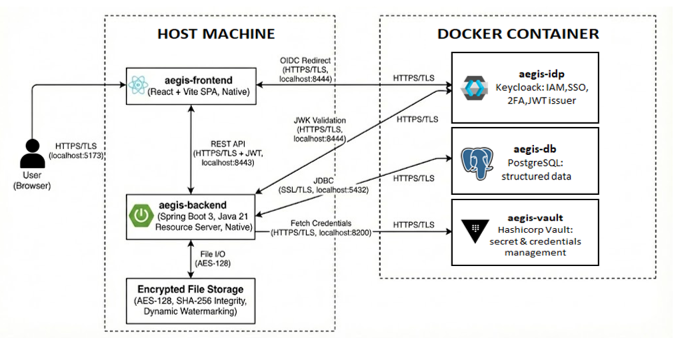
</p>


### 5.1 Componenti Funzionali

* **Frontend (`aegis-frontend`):** Single Page Application (SPA) sviluppata in **React + Vite**. Funge da interfaccia utente *stateless*, gestendo la sanificazione degli input, la presentazione dei dati oscurati e le interazioni sicure con le API REST.
* **Backend (`aegis-backend`):** Resource Server basato su **Java 21 / Spring Boot 3**. Costituisce il cuore del sistema: implementa i controlli di accesso granulari (Security Filter Chain), esegue la crittografia  (AES-128) e memorizzazione dei file, gestisce il log di audit immutabile.
* **Identity Provider (`aegis-idp`):** Istanza **Keycloak** dedicata all'Identity & Access Management (IAM). Gestisce il ciclo di vita delle utenze, impone l'autenticazione MFA, e rilascia token **JWT** standard OIDC per l'autorizzazione.
* **Database (`aegis-db`):** **PostgreSQL 16**. Responsabile della persistenza relazionale di metadati e dati strutturati. Configurata per accettare connessioni esclusivamente via **SSL/TLS** per garantire la protezione dei dati in transito.
* **Secrets Management (`aegis-vault`):** **HashiCorp Vault**. Sistema centralizzato per la custodia dei segreti (password DB, chiavi API). Le credenziali vengono iniettate dinamicamente nel backend all'avvio (*Dynamic Secrets*), prevenendo la presenza di password in chiaro nel codice sorgente o nei file di configurazione.

### 5.2 Decisioni architetturali

Le decisioni architetturali di Aegis rispondono a precisi requisiti di sicurezza e scalabilità, adottando pattern consolidati nell'ingegneria del software moderna:

1.  **Disaccoppiamento Frontend/Backend (Headless Architecture)**
    L'adozione di un'architettura con comunicazione esclusiva via **REST API su HTTPS** garantisce una netta separazione delle responsabilità. Il Backend agisce come puro *Resource Server* stateless, riducendo la superficie d'attacco e permettendo ai due livelli di scalare in modo indipendente.

2.  **Containerizzazione dei Servizi Critici**
    L'uso di Docker per i componenti infrastrutturali (Database, Keycloak, Vault) assicura l'immutabilità dell'ambiente e la coerenza tra sviluppo e produzione (*Environment Parity*). Mantenere l'applicazione su host in fase di sviluppo permette invece cicli di debug più rapidi.

3.  **Delega dell'Autenticazione (Pattern OIDC):**
    Il sistema delega interamente la gestione dell'identità all'Identity Provider esterno (**Keycloak**). Il backend non manipola password ma valida esclusivamente la firma crittografica dei token **JWT**, centralizzando la sicurezza e impedendo la registrazione autonoma (No Self-Registration) in conformità ai requisiti NOS.

4.  **Gestione Dinamica dei Segreti:**
    Per mitigare il rischio di *Secret Sprawl*, Aegis integra **HashiCorp Vault**. Le credenziali del database vengono iniettate dinamicamente nel contesto dell'applicazione solo all'avvio (*Fetch Credentials*), evitando la presenza di dati sensibili statici nel codice sorgente.

5.  **Storage Ibrido Ottimizzato:**
    Si adotta una strategia di persistenza mista per massimizzare le performance: i metadati relazionali risiedono su **PostgreSQL**, mentre i payload binari (allegati) sono archiviati su disco locale cifrati con **AES-128**. Questo evita di appesantire il database con BLOB voluminosi, mantenendo le query performanti.

### 5.3 Albero directory del progetto

L'organizzazione del codice sorgente rispetta il principio di **Separazione delle Responsabilità**. La struttura è modulare e separa nettamente il codice applicativo (/aegis-frontend e /aegis-backend) dalla configurazione infrastrutturale (/docker-env) e dal materiale crittografico (/certs e configurazioni ssl: /postgress-ssl, /keyloack-ssl), facilitando la manutenibilità e la sicurezza del deployment.

```text
AEGIS/
├── 📂 aegis-frontend/           # [FRONTEND] React Single Page Application (SPA)
│   ├── src/
│   │   ├── App.jsx             # Logica principale UI e Router
│   │   └── keycloak.js         # Configurazione Adapter OIDC
│   ├── public/                 # Asset statici
│   └── package.json            # Dipendenze Node.js
│
├── 📂 backend/
│   └── aegis-backend/          # [BACKEND] Spring Boot Application (Java 21)
│       ├── src/main/java/com/aegis/backend/
│       │   ├── controller/     # REST Endpoints Layer
│       │   ├── service/        # Business Logic Layer
│       │   ├── model/          # JPA Entities
│       │   ├── dto/            # Data Transfer Objects
│       │   └── security/       # Security Configuration (JWT, Filters)
│       ├── uploads/            # [LOCAL STORAGE] File cifrati (AES-128)
│       └── pom.xml             # Dipendenze Maven
│
├── 📂 docker-env/              # [INFRASTRUCTURE] Componenti Dockerizzati
│   ├── 📄 docker-compose.yml   # Orchestratore servizi
│   ├── 📂 init-db/             # Script SQL inizializzazione
│   ├── 📂 themes/              # Temi Keycloak
│   └── 📄 realm-export.json    # Configurazione Realm Keycloak
│
├── 📂 certs/                   # Certificati SSL/TLS condivisi
├── 📂 postgres-ssl/            # Chiavi Database
├── 📂 keycloak-ssl/            # Chiavi Identity Provider
└── 📄 *_SETUP.md               # Guide installazione
```

---

## 6. Stack Tecnologico

| Componente | Tecnologia | Ruolo |
| :--- | :--- | :--- |
| **Backend** | **Java 21**, Spring Boot 3 | Resource Server, Business Logic, Gestione File. |
| **Frontend** | **React**, Vite | Interfaccia Utente web (SPA) |
| **Auth** | OIDC, OAuth 2.0, JWT | Standard di Protocollo per Autenticazione e Autorizzazione. |
| **IAM** | **Keycloak** | Identity Provider (IdP), Gestione MFA, RBAC. |
| **Database** | **PostgreSQL 16** | Persistenza Dati relazionali e strutturati. |
| **Security** | **HashiCorp Vault** | Gestione centralizzata e rotazione dei segreti (Secret Management). |

### 6.1 Protocolli Crittografici
| Ambito | Standard / Algoritmo | Note |
| :--- | :--- | :--- |
| **Data in Transit** | **TLS 1.2+** | HTTPS forzato su tutti i canali di comunicazione (Client-Server, Server-DB). |
| **Data at Rest** | **AES-128** | Cifratura simmetrica dei file allegati (implementazione in [MissionService](cci:2://file:///c:/Users/franc/Desktop/SOAS/AEGIS/backend/aegis-backend/src/main/java/com/aegis/backend/service/MissionService.java:42:0-317:1)). |
| **Data Integrity** | **SHA-256** | Checksum calcolato su upload/download per garantire integrità del payload. |
| **Password Hashing** | **PBKDF2 / Argon2** | Gestito nativamente da Keycloak (configurabile per Realm). |
| **Token Signature** | **RS256** | Firma asimmetrica (RSA + SHA-256) per i token JWT. |

---

## 7. Modello Operativo e Ruoli

Il sistema gestisce la gerarchia e l'accesso ai dati su tre livelli di segretezza, ispirandosi alla logica **Bell-LaPadula**.

| Ruolo | Permessi e Visibilità |
| :--- | :--- |
| **Super Supervisor** | Amministrazione totale, visibilità globale, accesso ai Log di Audit.  |
| **Supervisor** | Creazione missioni, coordinamento assegnazione agenti a missioni.  |
| **Agent** | Operatività sul campo. Accesso limitato a pagina proprie missioni.  |

### Nota sulla Gestione delle Utenze
> La scelta architetturale di **inibire la registrazione autonoma degli utenti** risponde a un principio fondamentale di sicurezza nazionale. L'accesso deve essere concesso esclusivamente tramite canali istituzionali gerarchici, impedendo a chiunque di registrarsi senza una preventiva verifica della clearance e del Nulla Osta di Sicurezza.

---
## 8. Funzionalità Operative del Sistema

Il sistema Aegis offre un set di funzionalità progettate per garantire la compartimentazione delle informazioni e la sicurezza degli operatori, implementando rigorosi vincoli di clearance.

### 8.1 Autenticazione e Gestione Identità
* **Accesso Centralizzato:** Il sistema inibisce la registrazione autonoma; le utenze sono pre-caricate a livello statale e l'accesso avviene esclusivamente tramite login centralizzato.
* **Autenticazione Forte (MFA):** Implementazione di autenticazione a due fattori (OTP) per garantire l'identità dell'operatore.
* **Anonimato Operativo (Code Name):** I dati anagrafici completi (Nome, Cognome, Telefono, Ufficio) sono visibili esclusivamente ai Supervisor. All'interno delle missioni, l'unico identificativo visibile agli altri partecipanti è il **Code Name**, per proteggere l'identità degli agenti.

### 8.2 Gestione Missioni (Supervisor)
* **Creazione Vincolata:** I Supervisor possono creare missioni definendo zona geografica, descrizione, documento missione allegato e livello di sicurezza minimo richiesto.
    * *Vincolo di Sicurezza:* È possibile creare missioni solo con livello di segretezza uguale o inferiore al proprio (es. un Supervisor Livello 2 non può creare una missione Livello 3).
* **Gestione Operatori:** Assegnazione degli agenti tramite barra di ricerca.
    * *Vincolo di Assegnazione:* Il sistema permette di aggiungere solo utenti con clearance maggiore o uguale a quella della missione.
* **Workflow:** Gestione del ciclo di vita della missione con stati definiti (In istruttoria, Standby, In corso, Abortita, Conclusa) e indicatori visivi.

### 8.3 Operatività e Comunicazione (Agent)
* **Accesso Puntuale (UUID):** L'agente non dispone di funzionalità di ricerca libera o esplorativa. L'accesso alle missioni avviene esclusivamente tramite inserimento diretto del **UUID univoco** della missione. Il backend verifica l'assegnazione prima di concedere l'accesso: se l'agente non fa parte del team, la richiesta viene respinta (*403 Forbidden*), impedendo il *Forced Browsing*.
* **Interazione Vincolata (No Upload):** Per massimizzare la sicurezza, l'agente opera in modalità ristretta: non possiede permessi per il caricamento di file o allegati, ma può consultare la documentazione esistente in sola lettura.
* **Canale di Aggiornamento Sicuro:** L'unica modalità di scrittura consentita è la **Chat Criptata Mission-Specific**:
    * Consente l'invio di aggiornamenti operativi testuali in tempo reale.
    * **Input Sanitization:** Ogni messaggio è sottoposto a rigorosi filtri di validazione (Anti-Script/XSS) lato server *prima* di essere processato, garantendo che nessun codice malevolo possa essere iniettato nel sistema di comunicazione.

### 8.4 Super Supervisor (Governance & Audit)
Il ruolo di **Super Supervisor** rappresenta il vertice della catena di comando e di garanzia del sistema. A differenza dei ruoli operativi, possiede privilegi di amministrazione e audit estesi per garantire la sicurezza dello Stato:

* **Visibilità Globale (System High):** Accesso in lettura a **tutte le missioni** presenti nel sistema, indipendentemente dal livello di segretezza o dalla compartimentazione, per finalità di controllo, audit e supervisione strategica.
* **Gestione Dossier Personale:** Accesso completo ai fascicoli anagrafici di ogni Agente e Supervisor. È l'unica figura in grado di visualizzare l'identità reale associata ai *Code Name* (Nome, Cognome, Matricola, Riferimenti diretti) per tutti gli operatori censiti.
* **Autorità sulle Clearance (NOS):** È l'unica figura abilitata a **modificare il Livello di Sicurezza** degli utenti. Può promuovere un operatore (es. da Livello 1 a Livello 2) o, in caso di incidenti di sicurezza, sospenderlo immediatamente (declassamento a Livello 0), revocando l'accesso al sistema.
* **Intervento Operativo:** Ha la facoltà di intervenire forzatamente sul ciclo di vita di qualsiasi missione (es. forzare lo stato in *Abortita* o *Conclusa*) qualora la sicurezza operativa sia compromessa, senza necessitare dell'assegnazione diretta alla missione stessa.

### 8.5 Design System e Feedback Visivo (UX Semiotics)
L'interfaccia grafica (GUI) di Aegis adotta un tema **Dark Cyberpunk** moderno e immersivo. Questa scelta stilistica non è puramente estetica ma funzionale: il design scuro ad alto contrasto è ottimizzato per **ridurre l'affaticamento visivo** (*Eye Strain*) degli operatori impegnati in sessioni prolungate, specialmente in ambienti operativi a bassa luminosità o notturni.<br>
Per garantire la **Situational Awareness** immediata e prevenire errori di contesto (es. credere di essere in un ruolo diverso), l'interfaccia di Aegis adatta dinamicamente il proprio schema cromatico (Theme) in base al profilo dell'utente loggato.
Ogni colore è stato selezionato secondo precisi criteri semiotici per riflettere la natura del ruolo:

* 🔵 **AGENT - Tactical Blue (Blu Operativo)**
    * **Significato:** Il blu evoca stabilità, fiducia e calma sotto pressione.
    * **Funzione:** Progettato per gli operatori sul campo che necessitano di chiarezza mentale e focus assoluto sull'esecuzione della missione, riducendo l'affaticamento visivo durante la lettura delle informazioni sensibili.

* 🟠 **SUPERVISOR - Alert Orange (Arancio Tattico)**
    * **Significato:** L'arancione rappresenta l'attenzione, l'energia e la vigilanza attiva.
    * **Funzione:** Evidenzia il ruolo di coordinamento. Mantiene il Supervisore in stato di allerta, facilitando l'identificazione rapida di anomalie, cambi di stato critici e la gestione dinamica delle risorse.

* 🟣 **SUPER SUPERVISOR - Governance Purple (Viola Imperiale)**
    * **Significato:** Il viola è storicamente associato all'autorità suprema, alla saggezza e al giudizio.
    * **Funzione:** Distingue nettamente il livello di Audit/Governance dalla catena operativa standard. Sottolinea il potere di intervento straordinario (es. abortire missioni, revocare NOS) e la visione onnisciente ("God Mode") sul sistema.
---

## 9. Test d'Uso (Scenari Legittimi per Ruolo)
Questa sezione documenta le funzionalità operative consentite "Happy Path" per ciascuna tipologia di utente, verificando la corretta applicazione dei privilegi e dei flussi di lavoro.

### 9.1 Funzionalità Comuni (Tutti gli Utenti)
* **Login Sicuro:** Accesso al sistema inserendo username o email e Password. Il sistema verifica le credenziali contro l'Identity Provider (Keycloak).
 <p align="center">
  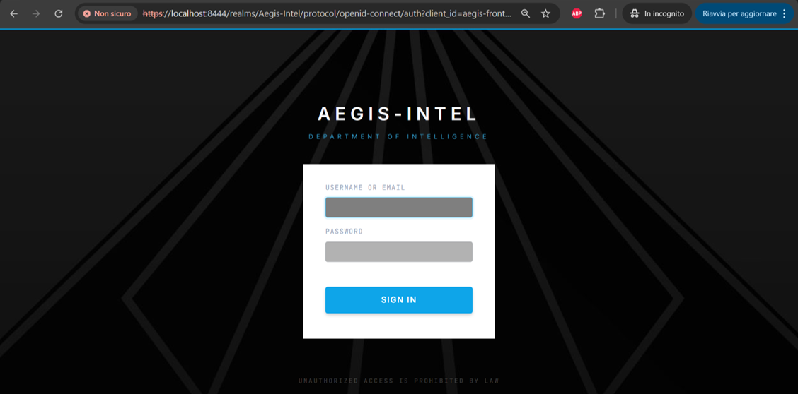
</p>

* **Verifica MFA:** Dopo il primo step, l'utente inserisce il codice OTP (6 cifre) generato dall'app Authenticator. L'accesso è garantito solo se entrambi i fattori sono validi.
<p align="center">
  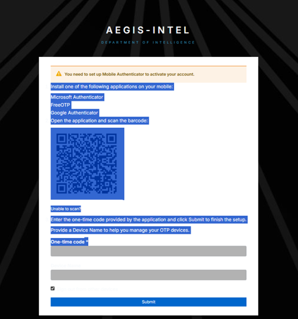
</p>

* **Logout:** Disconnessione sicura che invalida l'autenticazione.
<p align="center">
  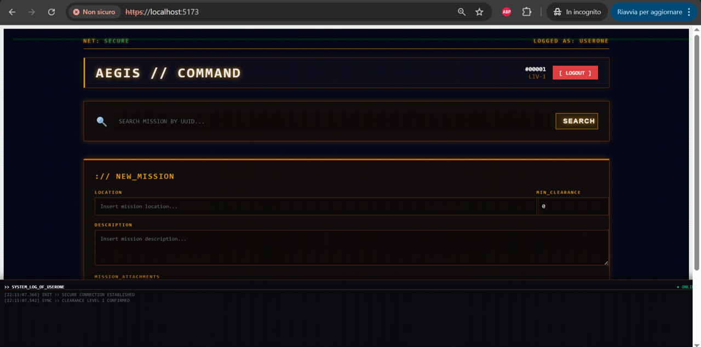
</p>

### 9.2 Ruolo: AGENT (Livello Operativo)
L'agente è il profilo con i permessi più restrittivi, UI BLU.
* **Accesso Missione (tramite UUID):** L'agente incolla l'UUID di una missione a lui comunicato. Se assegnato, accede alla dashboard; in caso contrario, riceve un errore di autorizzazione.
<p align="center">
  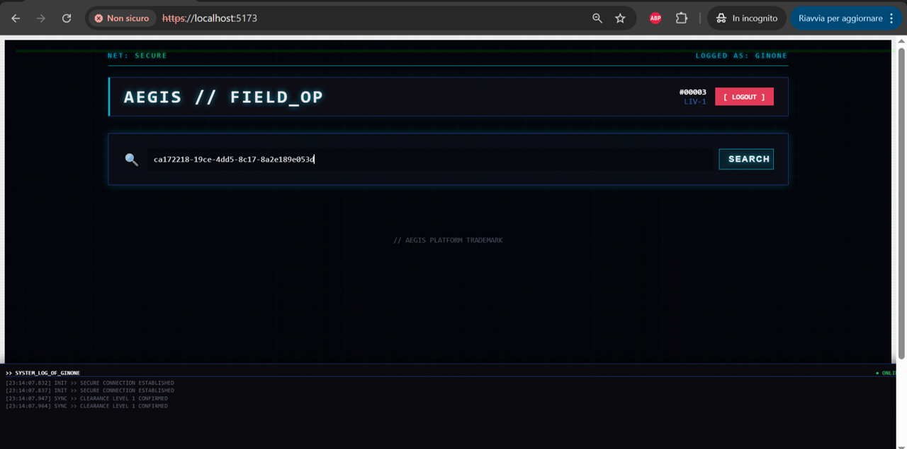
</p>

* **Visualizzazione Dati:** All'interno della missione, consulta dettagli, descrizione e lista partecipanti (visualizzando solo i *Code Name* dei colleghi).
<p align="center">
  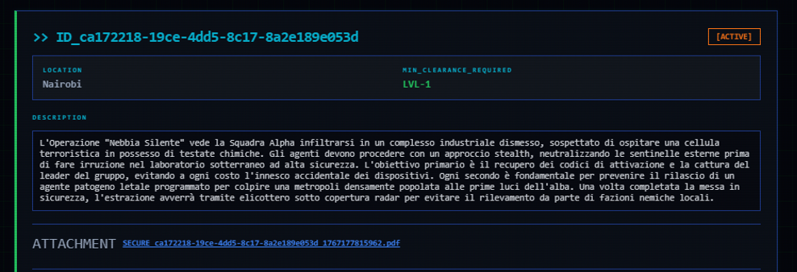
</p>

* **Comunicazione Criptata:** Lettura o invio messaggi di aggiornamento nella chat sicura della missione.
<p align="center">
  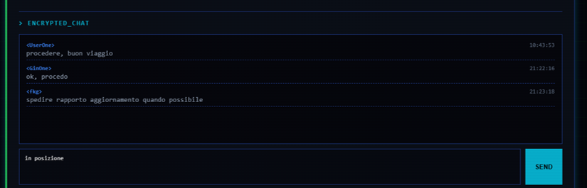
</p>

* **Lettura Documenti:** Scarica e visualizza i PDF allegati (che appaiono con watermark dinamico anti photoleak).
<p align="center">
  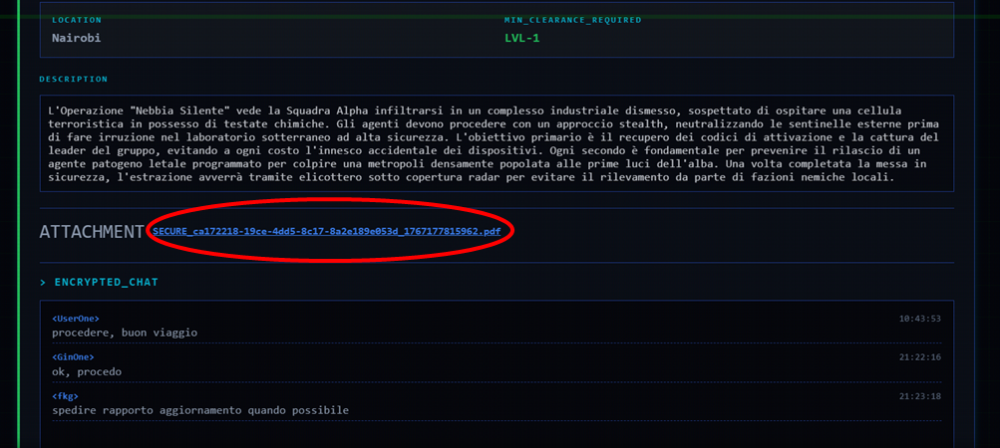
</p>
<p align="center">
  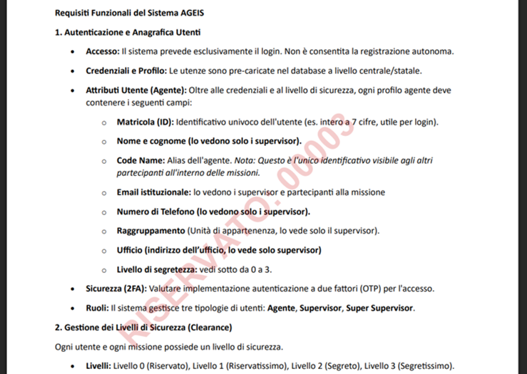
</p>

### 9.3 Ruolo: SUPERVISOR (Livello Tattico)
Il Supervisor gestisce il coordinamento e la creazione delle operazioni, UI ORANGE.

* **Creazione Missione:** Compila il form di nuova missione (Zona, Descrizione) impostando un livello di segretezza **uguale o inferiore** al proprio (es. un Supervisor Livello 2 non può creare missioni Livello 3).
<p align="center">
  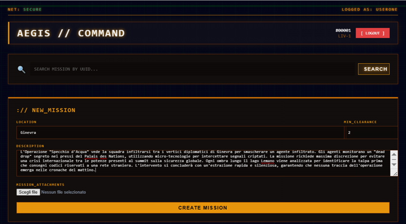
</p>

* **Gestione Team:** Cerca utenti nel database e li assegna alla missione. Il sistema permette l'aggiunta solo di operatori con **Clearance sufficiente** (>= livello missione).
* **Gestione Ciclo di Vita:** Modifica lo stato della missione (es. da "In Istruttoria" a "In Corso" o "Conclusa").
* **Visualizzazione Profili:** Ha accesso ai dati anagrafici completi (Nome, Cognome, Ufficio) degli agenti che coordina. 
<p align="center">
  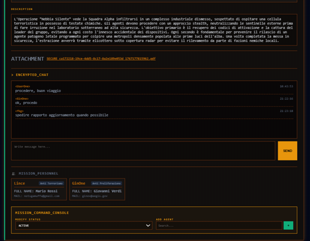
</p>

### 9.4 Ruolo: SUPER SUPERVISOR (Livello Strategico/Audit)
Il vertice della catena di comando con permessi di governance, UI PURPLE.
* **Audit Globale:** Visualizza l'elenco completo di **tutte le missioni** nel sistema, indipendentemente dal livello di segretezza o dall'assegnazione.
  <p align="center">
  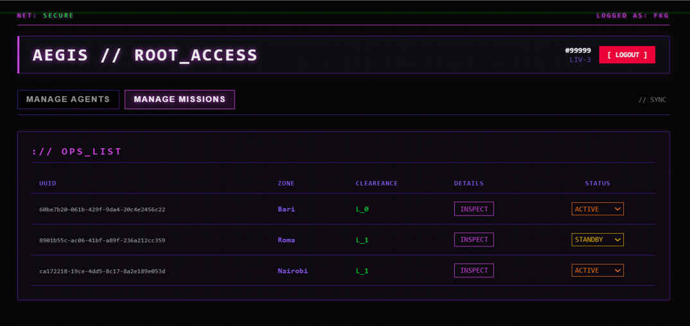
</p>

* **Gestione Clearance (NOS):** Accede al database di **tutti gli utenti**: agenti e supervisor, può elevare o revocare il livello di sicurezza (0-3).
 <p align="center">
  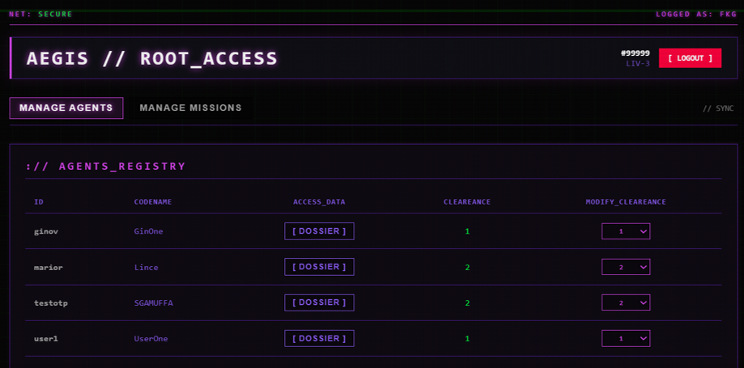
</p>

* **Intervento d'Emergenza:** Può forzare la chiusura ("Abortita") di qualsiasi missione in corso per motivi di sicurezza o cambiarne lo stato.
 <p align="center">
  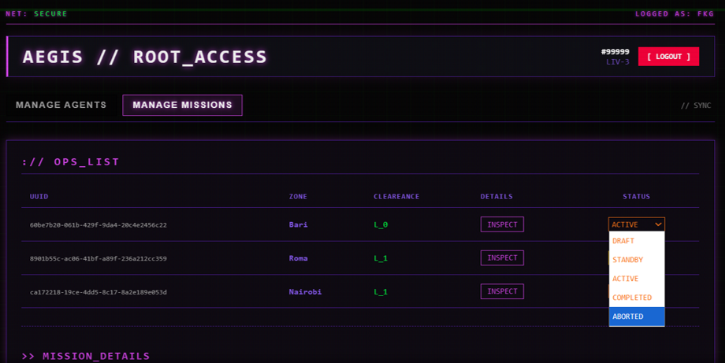
</p>

* **Accesso Anagrafica Completa:** Visualizza l'identità reale di qualsiasi *Code Name* presente nel sistema visionando il suo dossier.
 <p align="center">
  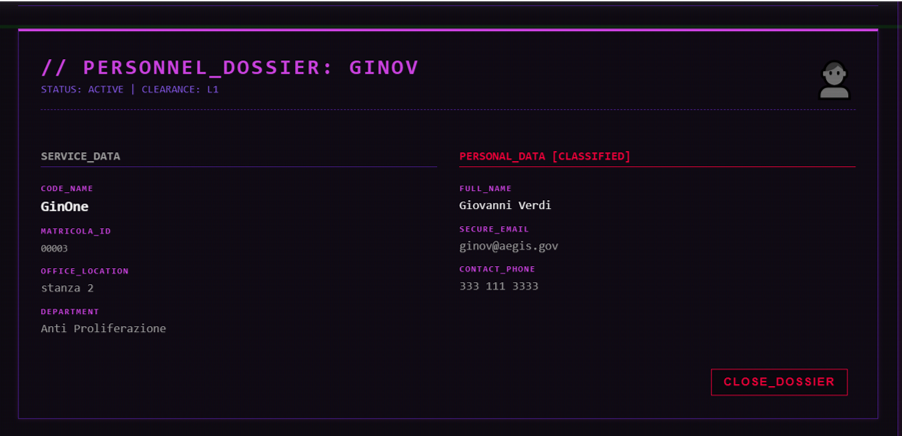
</p>

---

## 10. Test d'Abuso (Security Stress Test)
Questa sezione documenta i tentativi deliberati più comuni per violare i vincoli di sicurezza ("Negative Testing") dimostrando la resilienza dell'architettura Zero Trust.

### 10.1 Violazione della Gerarchia (No Read Up)
* **Scenario:** Un `Agente` (Livello 1) tenta di accedere tramite URL diretto (UUID) a una missione di Livello 2 a cui non è assegnato.
* **Azione:** `GET /api/intel/missions/{UUID-SEGRETO}` o tramite searchbar dell'UI.
* **Risultato:** Il sistema risponde con **403 Forbidden**. L'architettura applica una **doppia barriera di sicurezza** (*Defense in Depth*) nel Service Layer:
    1.  **Need-to-Know:** Il sistema verifica primariamente l'assegnazione. Non essendo l'agente nella lista autorizzata, la richiesta viene bloccata immediatamente.
    2.  **Bell-LaPadula:** Anche nell'ipotesi di un'assegnazione errata, scatterebbe il controllo gerarchico (*No Read Up*), bloccando l'accesso per clearance insufficiente.
    *Nota:* Il database viene interrogato esclusivamente per recuperare i metadati di controllo; nessun dato sensibile viene serializzato verso il client.
  <p align="center">
  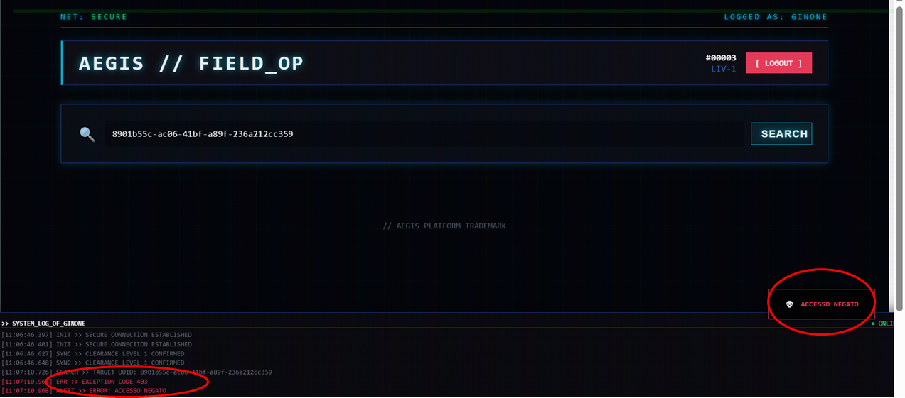
</p>

### 10.2 Privilege Escalation Orizzontale (BOLA/IDOR)
* **Scenario:** Un `Supervisor` ("Attaccante") tenta di manipolare una missione gestita da un collega ("Vittima") senza averne titolo.
* **Azione:** L'attaccante recupera l'UUID della missione target e invia una richiesta `PATCH /api/intel/missions/{UUID}/status` per forzarne la chiusura, oppure una `PUT` per modificarne i dettagli.
* **Risultato:**
    * **PATCH (Status):** Riceve **403 Forbidden**. Il Security Layer (`@PreAuthorize`) invoca `canAccessMission`, che verifica la relazione nel database: non essendo l'attaccante né l'**Owner** né un operatore **Assegnato**, l'accesso è negato.
    * **PUT (Dettagli):** Riceve **405 Method Not Allowed**. L'API è progettata per non esporre endpoint di modifica massiva, riducendo la superficie d'attacco strutturale.
* **Risultato complessivo:** Il sistema risponde con **403 Forbidden**. Il Security Filter verifica che l'utente non sia né l'owner né un partecipante autorizzato.


### 10.3 Injection nella Chat (XSS/Scripting)
* **Azione:** Un operatore tenta di inviare nella chat un payload malevolo (`<script>alert('HACKED')</script>`) o un link di phishing (`http://malware.site`).
* **Risultato:** Il sistema neutralizza la minaccia applicando una difesa a due livelli (*Defense in Depth*):
    * **Link (Backend Side):** Il `MissionService` applica un controllo rigoroso tramite **Regex**. Se viene rilevato un pattern URL, la richiesta viene **respinta** con un'eccezione di sicurezza (`SecurityException`), impedendo che il dato venga salvato nel database.
    * **XSS (Frontend Side):** L'input viene sanificato in tempo reale rimuovendo i caratteri critici (`<`, `>`). Il payload viene convertito in semplice testo inerte (es. `script...`), rendendo tecnicamente impossibile l'esecuzione del codice nel browser degli altri partecipanti.
<p align="center">
  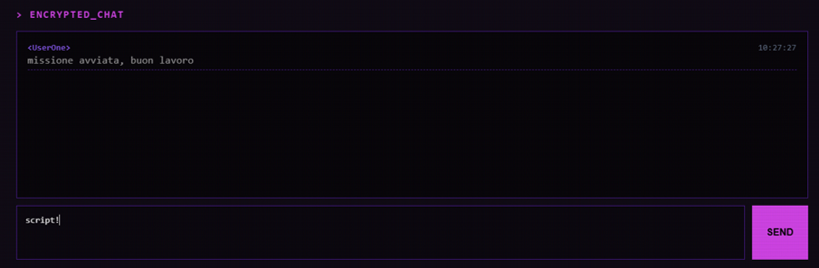
</p>

### 10.4 Bypass dell'Autenticazione (Direct API Access)
* **Scenario:** Un attaccante tenta di aggirare l'interfaccia utente invocando direttamente le API di Backend tramite terminale o script, senza fornire credenziali valide.
* **Azione:** Esecuzione di una chiamata cruda verso un endpoint protetto:
  ```bash
  curl -k -I https://localhost:8443/api/intel/missions
  ```
* **Risultato:** Il server risponde istantaneamente con **401 Unauthorized**.
* **Analisi Tecnica:** Il backend è configurato come **OAuth2 Resource Server** stateless. La richiesta viene intercettata dal `SecurityFilterChain` di Spring Boot *prima* di raggiungere qualsiasi Controller Java. Il filtro esegue tre validazioni sequenziali bloccanti:
    1. **Header Check:** Verifica la presenza dell'header `Authorization: Bearer <token>`.
    2. **Crypto Validation:** Se il token è presente, il server scarica la chiave pubblica (JWK) da Keycloak e valida matematicamente la firma digitale.
    3. **Expiration Check:** Verifica che il token non sia scaduto (claim `exp`).
    
    In assenza di un token valido emesso dall'Identity Provider istituzionale, l'API rimane completamente inaccessibile e invisibile.
---

## 11. Guida all'Installazione 

**Prerequisiti:** Docker, Java 21, Node.js 20+.

### 11.1. Avvio Infrastruttura
Lanciare i servizi di supporto (DB, Keycloak, Vault).

```bash
cd docker-env
docker-compose up -d
# Attendere l'inizializzazione dei container.
```

### 11.2. Configurazione Backend
Il backend attende che Vault e DB siano pronti.

```bash
cd backend/aegis-backend
mvn spring-boot:run
```
*Il server si avvierà sulla porta **8443** (HTTPS).*

### 11.3. Avvio Frontend

```bash
cd aegis-frontend
npm install
npm run dev
```
*Accessibile a https://localhost:5173.*

Nota: Essendo un ambiente locale con certificati auto-firmati (certs/), sarà necessario accettare le eccezioni di sicurezza nel browser per localhost:8443 (Backend) e localhost:8444 (Keycloak).

**Nota per l'installazione:** Questa guida fornisce i passaggi rapidi per l'avvio tramite Docker.
> Per istruzioni dettagliate passo-passo specifiche per il tuo sistema operativo (configurazione variabili d'ambiente, prerequisiti, ecc.), consulta i file dedicati presenti nella root del progetto:
> * `WINDOWS_SETUP.md`
> * `MAC_SETUP.md`
> * `LINUX_SETUP.md`

### 11.4 Credenziali di Default (Ambiente di Sviluppo)

> ⚠️ **ATTENZIONE - NOTA DI SICUREZZA**
> Le seguenti credenziali sono configurate **esclusivamente per l'ambiente di test locale**. Sono volutamente semplificate e deboli per facilitare la valutazione e il testing del sistema.
> In qualsiasi scenario di deployment reale o produzione, è **obbligatorio** modificare immediatamente queste password e ruotare i token amministrativi.

| Servizio | URL Console | Metodo Accesso | Credenziali |
| :--- | :--- | :--- | :--- |
| **Keycloak** (IAM) | `https://localhost:8444` | Basic Auth | **Username:** `admin`<br>**Password:** `admin` |
| **HashiCorp Vault** | `http://localhost:8200` | Token Auth | **Root Token:** `root_token_segreto` |

---

## 12. Risoluzione Problemi (Troubleshooting)

In caso di difficoltà durante l'avvio o l'utilizzo della piattaforma in ambiente locale, consultare la seguente tabella:

| Sintomo | Causa Probabile | Soluzione Tecnica |
| :--- | :--- | :--- |
| **Browser: "La connessione non è privata" / "Not Secure"** | Utilizzo di certificati SSL auto-firmati per `localhost` (non riconosciuti dalle CA pubbliche). | Cliccare su **"Avanzate"** -> **"Procedi su localhost (non sicuro)"**. È necessario accettare l'eccezione sia per il Frontend (`:5173`) che per il Backend/Keycloak (`:8443`, `:8444`). |
| **Backend: "Connection Refused" all'avvio** | *Race Condition* nell'orchestrazione Docker: il Backend tenta di connettersi a Vault o DB prima che siano completamente inizializzati. | Attendere 30 secondi affinché i servizi infrastrutturali siano pronti, quindi riavviare solo il backend: `docker restart aegis-backend` (o rilanciare `mvn spring-boot:run` se in locale). |
| **Login: Reindirizzamento continuo (Loop)** | Cookie di sessione obsoleti o conflitti di cache nel browser. | Provare l'accesso in una finestra di **Navigazione in Incognito** o pulire i cookie relativi a `localhost`. Verificare anche che l'orologio di sistema sia sincronizzato. |
| **Swagger UI: "Network Error" / "Failed to fetch"** | Il browser blocca le chiamate AJAX verso il backend perché il certificato SSL non è stato esplicitamente accettato. | Aprire una nuova scheda, visitare `https://localhost:8443/api/hello` (o un endpoint qualsiasi) e accettare il rischio di sicurezza. Ricaricare Swagger UI. |
| **Vault: "Sealed" status** | Il container di Vault si è riavviato e ha perso lo stato di *unseal* (se non configurato per l'auto-unseal in dev). | Eseguire lo script di ripristino o riavviare l'intero stack `docker-compose down && docker-compose up -d`. |
| **Frontend: Schermata Bianca** | Il Frontend non riesce a contattare Keycloak per scaricare la configurazione OIDC. | Verificare che Keycloak sia raggiungibile via browser a `https://localhost:8444` e che non ci siano blocchi CORS nella console sviluppatore (F12). |

---

## 13. Riferimenti Normativi e Teorici

L'architettura di sicurezza di Aegis è stata progettata in conformità con i seguenti standard governativi e modelli accademici:

* **[DPCM 6 novembre 2015](https://www.gazzettaufficiale.it/eli/id/2015/12/01/15A09048/sg)** – *"Disposizioni per la tutela amministrativa del segreto di Stato e delle informazioni classificate"*: Costituisce il riferimento normativo per la gestione del **NOS** (Nulla Osta di Sicurezza) e per i livelli di classificazione implementati nel sistema.

* **Modello Bell-LaPadula (1973)** – Modello formale per il controllo degli accessi mandatorio (**M.A.C.**): Il sistema applica rigorosamente la proprietà matematica *No Read Up* per garantire la confidenzialità dei dati tra livelli gerarchici differenti.

* **[NIST SP 800-207](https://csrc.nist.gov/publications/detail/sp/800-207/final)** – *"Zero Trust Architecture"*: Standard statunitense che guida l'approccio architetturale del progetto, basato sul principio che nessuna fiducia sia implicita (indipendentemente dalla posizione di rete) e sulla verifica continua di ogni transazione.

